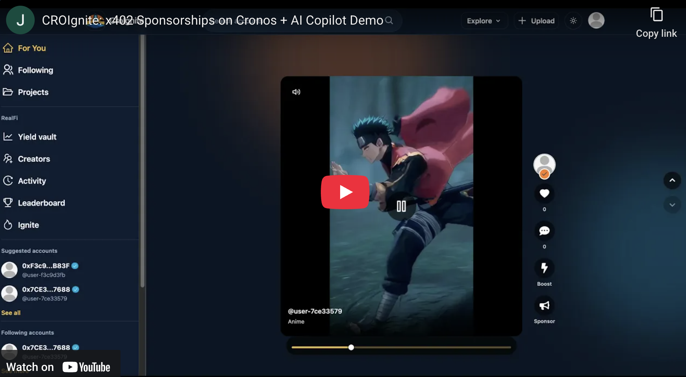

# CroIgnite

Creator-first short-video platform where sponsorships are settled via x402 on Cronos and can mint on-chain invoice receipt NFTs.

[](https://croignite.vercel.app/demo-video)

## Cronos x402 Paytech Hackathon (Submission)

- **Tracks:** Main Track (x402 Applications) + Crypto.com × Cronos Ecosystem Integrations
- **Network:** Cronos EVM Testnet (`338`)
- **Settlement asset:** devUSDC.e (gas in tCRO)
- **Demo runbook:** `docs/youtube-demo-script.md`

### Tracks We Joined + Why We Win

**Track 1 — Main Track (x402 Applications)**
- **Core x402 flow in production UI:** sponsorships can settle via HTTP 402 → signature → facilitator settle on Cronos.
- **Pay‑per‑action model:** sponsor execution is metered at the API layer (x402) and logged on-chain.
- **Agent‑ready design:** prompts and actions are structured so AI can plan, then users execute with deterministic settlement.

**Track 3 — Crypto.com × Cronos Ecosystem Integrations**
- **Cronos‑native settlement:** devUSDC.e payments and Cronos explorer links baked into the flows.
- **Cronos x402 facilitator:** uses official payment requirements + verification + settlement path.
- **Crypto.com AI Agent Copilot:** Ignite provides Cronos testnet insights and sponsorship planning.

### Project Links

- **Live URL:** https://croignite.vercel.app
- **Demo video:** https://croignite.vercel.app/demo-video
- **Contract addresses:** https://croignite.vercel.app/contract-addresses

## What CroIgnite Builds

CroIgnite turns sponsorship spend into auditable, on-chain cash-flow primitives on Cronos:

- **Fans + brands** sponsor clips with devUSDC.e. The on-chain sponsorship flow mints an **Invoice Receipt NFT** containing the sponsorship **terms hash** and payment metadata.
- **Creators** receive sponsorship payouts as **ERC-4626 boost vault shares** on the on-chain sponsor flow (per-creator vaults), so future yield + donations accrue transparently.
- **Protocol fees** from the on-chain sponsor hub route into the ERC-4626 yield vault, creating a shared revenue stream.
- **x402 paywall flows** allow pay-per-request sponsorship settlement using HTTP 402 → signature → verify/settle.
- **Creator tooling** includes an **AI-assisted editor** (Remotion + FFmpeg WASM) with Sora BYOK for generating clips, editing, and exporting MP4s.
- **Crypto.com AI Agent Copilot** helps sponsors query Cronos testnet data and plan sponsorship actions.

## One-Pager (Problem → Solution → Why It Wins)

### Problem

Creators and sponsors struggle with (1) **opaque off-chain sponsorship deals**, (2) **unclear payment terms + deliverables**, and (3) **limited automation** for payment settlement and post-campaign reporting.

### Solution

CroIgnite makes sponsorship a composable on-chain primitive:

- Sponsorship terms become a **canonical JSON payload**, hashed and anchored on-chain as a **terms hash**.
- Payment becomes a **tokenized invoice receipt** (ERC-721) that sponsors can prove on-chain.
- Creator payouts deposit into **per-creator ERC-4626 boost vaults** (standardized, composable accounting).
- x402 endpoints **monetize actions per request** using HTTP 402 semantics and Cronos facilitator settlement.

### Business model (MVP)

- **Protocol fee bps on sponsorships** (routed into the yield vault and fully auditable on-chain).
- **Pay-per-request fees** for sponsor actions (x402) that monetize API access without subscriptions.

### Roadmap

- Replace `SimulatedYieldStreamer` with real yield sources and automated harvesting.
- Expand receipt metadata with optional off-chain storage (IPFS/Arweave) referenced by the on-chain terms hash.
- Add an AI campaign planner that batches sponsor execution via x402.

## Track Alignment (How This Matches Cronos x402 Criteria)

### Track 1 — Main Track (x402 Applications)

- **x402 paywall flow:** `/api/x402/sponsor` returns HTTP 402, verifies payment headers, and settles on Cronos.
- **Pay-per-action:** sponsor calls become metered actions, ideal for agentic or automated flows.
- **Judging edge:** shows a real, end‑to‑end x402 settlement inside the core sponsorship UX.

### Track 3 — Crypto.com × Cronos Ecosystem Integrations

- **Cronos-native settlement:** devUSDC.e on Cronos EVM testnet with Cronos explorer links.
- **Cronos facilitator integration:** standardized payment requirements + settlement via Cronos x402 infra.
- **Crypto.com AI Agent Copilot:** `/ignite` queries Cronos testnet via the official AI Agent client.
- **Judging edge:** combines Cronos infra + Crypto.com AI tooling in one cohesive product.

## Judging Criteria (How Judges Can Evaluate CroIgnite)

- **Innovation:** x402 pay‑per‑request sponsorships + on‑chain invoice receipts + creator vault accounting.
- **Agentic functionality:** AI copilot plans campaigns; execution uses deterministic x402 settlement.
- **Execution quality:** end‑to‑end sponsor flow, receipt view, and explorer‑verifiable transactions.
- **Ecosystem value:** Cronos devUSDC.e settlement, facilitator integration, and reusable vault primitives.

## Quick Judge Walkthrough (5 minutes)

1. `/` → connect wallet from the header → open a clip → `/post/[postId]/[userId]` for comments/social proof.
2. `/sponsor/[postId]` → enter terms + sponsor amount → mint Invoice Receipt NFT → view `/campaign/[campaignId]`.
3. `/x402-demo` → run a real HTTP 402 sponsor settlement and view the Cronos explorer tx.
4. `/ignite` → ask the Crypto.com AI Agent about Cronos testnet activity and sponsorship planning.
5. `/activity` + `/leaderboard` → verify events and rankings with explorer links.

Optional: `/start` for faucet links if the wallet needs tCRO or devUSDC.e.

For a full recorded demo script (screen-by-screen + voiceover), see `docs/youtube-demo-script.md`.

## Architecture

### App stack

- **Frontend:** Next.js 15 (App Router) + TypeScript + Tailwind + shadcn/ui
- **Backend:** Convex (profiles, posts, comments, follows, projects, campaigns, receipts, leaderboards)
- **Wallet + web3:** RainbowKit + wagmi/viem on Cronos EVM Testnet
- **Editor:** Remotion + FFmpeg WASM, Redux Toolkit + IndexedDB persistence (scoped to connected wallet)

### Key routes

- **Feeds & social:** `/`, `/following`, `/creators`, `/profile/[id]`, `/post/[postId]/[userId]`
- **Sponsorship + receipts:** `/sponsor/[postId]`, `/campaign/[campaignId]`, `/activity`, `/leaderboard`, `/x402-demo`
- **AI Copilot:** `/ignite`
- **Vaults:** `/yield`, `/boost/[creatorId]`, `/contract-addresses`
- **Creator tooling:** `/projects`, `/projects/[id]`, `/upload`, `/settings`
- **Admin:** `/admin/boost-pass`

### API endpoints

- **x402 sponsor:** `/api/x402/sponsor`
- **AI agent query:** `/api/agent/query`
- **Creator vault provisioning:** `/api/creator-vault/resolve`
- **AI BYOK + Sora:** `/api/settings/openai-key`, `/api/sora`, `/api/sora/content`
- **Perks:** `/api/boost-pass/remix-pack`, `/api/sponsor/remix-pack`

### Smart contracts (`blockchain/contracts/realfi`)

- `ClipYieldVault` (ERC-4626): protocol vault; receives protocol fees + yield donations.
- `ClipYieldBoostVaultFactory`: deploys one boost vault per creator.
- `ClipYieldBoostVault` (ERC-4626): creator-specific vault; sponsorship payouts deposit as shares.
- `ClipYieldSponsorHub`: sponsorship entrypoint; fee split + deposit into boost vault; mints receipt NFT.
- `ClipYieldInvoiceReceipts` (ERC-721): tokenized invoice receipts with on-chain metadata.
- `ClipYieldBoostPass` (ERC-1155): soulbound, epoch-based perk pass (claim gated by eligibility).
- `SimulatedYieldStreamer`: testnet yield stream simulator that drips devUSDC.e to the protocol vault.

## Local Development

### Prereqs

- Node.js 20+
- pnpm

### Setup

```bash
pnpm install
cp .env.example .env.local
```

Populate the required env vars in `.env.local` (see `.env.example`). For the full on-chain experience you must set the `NEXT_PUBLIC_*_ADDRESS` contract vars; the easiest path is to deploy contracts and run `pnpm contracts:sync`.

Then run the app (2 terminals):

```bash
# terminal 1
pnpm convex:dev

# terminal 2
pnpm dev
```

Useful commands:

```bash
pnpm lint
pnpm typecheck
pnpm ffmpeg:sync-core
pnpm convex:deploy
pnpm convex:reset
```

Environment requirements:

- **x402 smoke test:** `X402_TEST_BUYER_PRIVATE_KEY`, `X402_SELLER_WALLET` (funded with devUSDC.e)
- **AI agent smoke test:** `OPENAI_API_KEY`, `CRONOS_TESTNET_EXPLORER_API_KEY`
- **Optional:** `NEXT_PUBLIC_CRONOS_TESTNET_RPC_URL` (defaults to `https://evm-t3.cronos.org`)

Facilitator readiness check (official endpoints):

```bash
curl -X GET https://facilitator.cronoslabs.org/healthcheck
curl -X GET https://facilitator.cronoslabs.org/v2/x402/supported
```

### Required configuration (high level)

See `.env.example` for the canonical list. The most important vars for a full demo are:

- **Convex:** `CONVEX_DEPLOYMENT`, `NEXT_PUBLIC_CONVEX_URL`
- **WalletConnect:** `NEXT_PUBLIC_WALLETCONNECT_PROJECT_ID`
- **Cronos contracts (public):** `NEXT_PUBLIC_CROIGNITE_VAULT_ADDRESS`, `NEXT_PUBLIC_BOOST_FACTORY_ADDRESS`, `NEXT_PUBLIC_SPONSOR_HUB_ADDRESS`, `NEXT_PUBLIC_INVOICE_RECEIPTS_ADDRESS`, `NEXT_PUBLIC_BOOST_PASS_ADDRESS`, `NEXT_PUBLIC_YIELD_STREAMER_ADDRESS`
- **x402:** `X402_SELLER_WALLET`, `X402_DEFAULT_AMOUNT`, `X402_DESCRIPTION`, `X402_MAX_TIMEOUT_SECONDS` (optional: `X402_TEST_BUYER_PRIVATE_KEY` for CLI header generation)
- **x402 network/logging:** `X402_NETWORK` (defaults to `cronos-testnet`), `LOG_LEVEL`
- **AI Studio:** `OPENAI_BYOK_COOKIE_SECRET` (OpenAI API key is BYOK via `/settings`)
- **AI Copilot:** `OPENAI_API_KEY`, `CRONOS_TESTNET_EXPLORER_API_KEY`

## Contracts (Hardhat / Cronos Testnet)

1. Create a deployer env file:

```bash
cp blockchain/.env.example blockchain/.env
```

2. Compile:

```bash
pnpm build:contracts
```

3. Deploy + verify (Ignition):

```bash
pnpm --filter blockchain-hardhat exec hardhat ignition deploy ./ignition/modules/ClipYieldModule.ts \
  --network cronosTestnet \
  --deployment-id croignite-cronos-testnet \
  --verify
```

4. Sync ABIs + write addresses into `.env.local` (defaults to `croignite-cronos-testnet`):

```bash
pnpm contracts:sync
```

## Notes on Privacy, Security, and Compliance

- **BYOK keys:** OpenAI keys are stored in encrypted HTTP-only cookies (server-only secret: `OPENAI_BYOK_COOKIE_SECRET`).
- **Testnet disclaimer:** Cronos EVM Testnet flows are for demo/MVP validation and are not financial advice.
